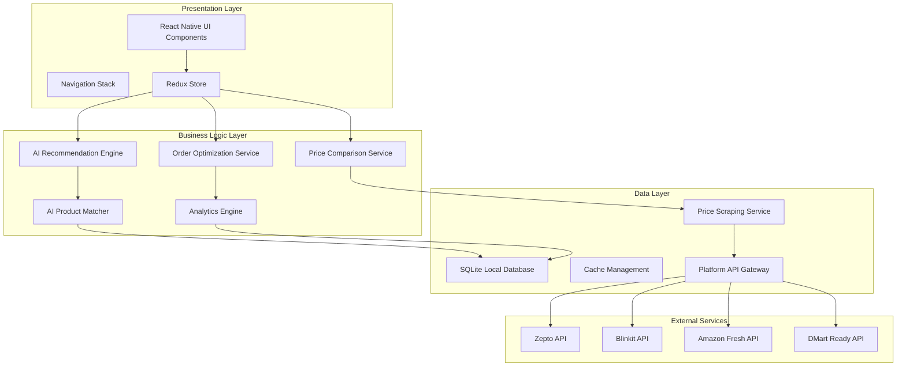

# Design Document: Grocery Price Optimizer

## Overview

The Grocery Price Optimizer is a sophisticated React Native application that leverages artificial intelligence to revolutionize grocery shopping across India. The system employs advanced algorithms for real-time price comparison, intelligent product matching, and order optimization across multiple delivery platforms including Zepto, Blinkit, Amazon Fresh, and DMart Ready.

The application's core innovation lies in its AI-powered recommendation engine that understands product equivalency, quality tiers, and user preferences to provide personalized shopping optimization. The system combines machine learning for product matching, optimization algorithms for order distribution, and predictive analytics for consumption insights.

## Architecture

The application follows a modular, service-oriented architecture designed for scalability and maintainability:



## Components and Interfaces

### Core Services

#### PriceComparisonService
```typescript
interface PriceComparisonService {
  compareProductPrices(productQuery: string): Promise<PriceComparison[]>;
  getLowestPriceOption(comparisons: PriceComparison[]): PriceComparison;
  calculateTotalCost(price: number, deliveryFee: number, platformFee: number): number;
  refreshPriceData(productIds: string[]): Promise<void>;
}

interface PriceComparison {
  productId: string;
  productName: string;
  platform: Platform;
  price: number;
  deliveryFee: number;
  platformFee: number;
  totalCost: number;
  availability: boolean;
  estimatedDeliveryTime: number;
  confidence: number;
}
```

#### AIRecommendationEngine
```typescript
interface AIRecommendationEngine {
  generateAlternatives(product: Product, strictness: AlternativeStrictness): Promise<ProductAlternative[]>;
  suggestBrandSwitches(product: Product, qualityTier: QualityTier): Promise<BrandSuggestion[]>;
  calculateSimilarityScore(product1: Product, product2: Product): number;
  updateUserPreferences(userId: string, preferences: UserPreferences): void;
}

interface ProductAlternative {
  originalProduct: Product;
  alternativeProduct: Product;
  similarityScore: number;
  potentialSavings: number;
  qualityMatch: number;
  reasoning: string;
}

interface BrandSuggestion {
  originalBrand: string;
  suggestedBrand: string;
  qualityTier: QualityTier;
  reputationScore: number;
  potentialSavings: number;
  marketPositioning: string;
}
```

#### OrderOptimizationService
```typescript
interface OrderOptimizationService {
  optimizeOrderDistribution(cart: CartItem[]): Promise<OptimizationResult>;
  calculateBulkOpportunities(products: Product[]): BulkOpportunity[];
  findFreeDeliveryOptions(cart: CartItem[]): DeliveryOptimization[];
  generateOrderStrategies(cart: CartItem[]): OrderStrategy[];
}

interface OptimizationResult {
  strategies: OrderStrategy[];
  totalSavings: number;
  recommendedStrategy: OrderStrategy;
  freeDeliveryAchieved: boolean;
}

interface OrderStrategy {
  platformDistribution: PlatformOrder[];
  totalCost: number;
  totalSavings: number;
  deliveryTime: number;
  freeDeliveryCount: number;
}
```

#### AIProductMatcher
```typescript
interface AIProductMatcher {
  matchProductsAcrossPlatforms(productQuery: string): Promise<ProductMatch[]>;
  validateProductEquivalency(product1: Product, product2: Product): MatchConfidence;
  learnFromUserFeedback(match: ProductMatch, userConfirmation: boolean): void;
  improveMatchingAccuracy(trainingData: MatchingTrainingData[]): void;
}

interface ProductMatch {
  products: Product[];
  confidence: number;
  matchingFactors: string[];
  uncertaintyFlags: string[];
}

interface MatchConfidence {
  score: number;
  factors: ConfidenceFactor[];
  requiresVerification: boolean;
}
```

### Data Models

#### Product and Pricing Models
```typescript
interface Product {
  id: string;
  name: string;
  brand: string;
  category: string;
  subcategory: string;
  qualityTier: QualityTier;
  specifications: ProductSpecification[];
  images: string[];
  description: string;
  ingredients?: string[];
  nutritionalInfo?: NutritionalInfo;
}

interface ProductSpecification {
  attribute: string;
  value: string;
  unit?: string;
}

interface PriceData {
  productId: string;
  platform: Platform;
  price: number;
  currency: string;
  unit: string;
  quantity: number;
  costPerUnit: number;
  discountPercentage?: number;
  bulkOffers: BulkOffer[];
  lastUpdated: Date;
}

interface BulkOffer {
  minQuantity: number;
  discountPercentage: number;
  costPerUnit: number;
  totalSavings: number;
}
```

#### User and Preference Models
```typescript
interface UserPreferences {
  alternativeStrictness: AlternativeStrictness;
  preferredBrands: string[];
  avoidedBrands: string[];
  qualityPreferences: QualityPreference[];
  budgetConstraints: BudgetConstraint[];
  dietaryRestrictions: string[];
  deliveryPreferences: DeliveryPreference;
}

interface ConsumptionPattern {
  productId: string;
  averageMonthlyQuantity: number;
  purchaseFrequency: number;
  seasonalVariation: SeasonalData[];
  priceElasticity: number;
}

enum AlternativeStrictness {
  STRICT = 'strict',
  MODERATE = 'moderate',
  FLEXIBLE = 'flexible'
}

enum QualityTier {
  PREMIUM = 'premium',
  STANDARD = 'standard',
  BUDGET = 'budget'
}
```

### Platform Integration Layer

#### PlatformAPIGateway
```typescript
interface PlatformAPIGateway {
  fetchProductData(platform: Platform, query: string): Promise<PlatformProduct[]>;
  getProductPricing(platform: Platform, productId: string): Promise<PriceData>;
  checkProductAvailability(platform: Platform, productId: string): Promise<boolean>;
  getDeliveryOptions(platform: Platform, location: string): Promise<DeliveryOption[]>;
  placeOrder(platform: Platform, orderDetails: OrderDetails): Promise<OrderConfirmation>;
}

interface PlatformProduct {
  platformProductId: string;
  name: string;
  brand: string;
  price: number;
  availability: boolean;
  images: string[];
  specifications: Record<string, string>;
  ratings: ProductRating;
}
```

## Data Models

### Core Data Structures

The application uses a normalized data structure optimized for real-time price comparisons and AI-powered recommendations:

```typescript
// Product Catalog Schema
interface ProductCatalog {
  products: Map<string, Product>;
  categories: CategoryHierarchy;
  brands: BrandRegistry;
  qualityMappings: QualityTierMapping[];
}

// Price Index Schema
interface PriceIndex {
  pricesByProduct: Map<string, PlatformPrices>;
  priceHistory: Map<string, PriceHistoryEntry[]>;
  bulkOffers: Map<string, BulkOffer[]>;
  lastUpdated: Map<string, Date>;
}

// User Data Schema
interface UserProfile {
  id: string;
  preferences: UserPreferences;
  consumptionHistory: ConsumptionPattern[];
  savingsAchieved: SavingsRecord[];
  watchlist: WatchlistItem[];
  orderHistory: OrderRecord[];
}

// Analytics Schema
interface AnalyticsData {
  userMetrics: UserMetrics;
  productMetrics: ProductMetrics;
  platformMetrics: PlatformMetrics;
  savingsMetrics: SavingsMetrics;
}
```

### AI Model Data Structures

```typescript
// Product Similarity Model
interface SimilarityModel {
  featureVectors: Map<string, number[]>;
  similarityMatrix: Map<string, Map<string, number>>;
  categoryWeights: Map<string, CategoryWeight>;
  brandEquivalencies: BrandEquivalency[];
}

// Recommendation Model
interface RecommendationModel {
  userEmbeddings: Map<string, number[]>;
  productEmbeddings: Map<string, number[]>;
  collaborativeFilters: CollaborativeFilter[];
  contentBasedFilters: ContentBasedFilter[];
}

// Optimization Model
interface OptimizationModel {
  deliveryThresholds: Map<Platform, number>;
  platformFees: Map<Platform, FeeStructure>;
  deliveryZones: Map<string, DeliveryZone>;
  optimizationWeights: OptimizationWeights;
}
```

## Correctness Properties

*A property is a characteristic or behavior that should hold true across all valid executions of a system-essentially, a formal statement about what the system should do. Properties serve as the bridge between human-readable specifications and machine-verifiable correctness guarantees.*

### Property Reflection

After analyzing all acceptance criteria, several properties can be consolidated to eliminate redundancy:

- Properties related to Alternative_Strictness filtering (6.2, 6.3, 6.4) can be combined into a single comprehensive property
- Properties about information display requirements can be grouped by component type
- Properties about AI recommendation factors can be consolidated into comprehensive recommendation validation
- Properties about order optimization can be combined to test the overall optimization algorithm

### Core System Properties

**Property 1: Multi-platform price data collection**
*For any* system startup, the Price_Scraper should successfully collect pricing data from all configured platforms (Zepto, Blinkit, Amazon Fresh, DMart Ready) within the initialization timeout
**Validates: Requirements 1.1**

**Property 2: Search response time compliance**
*For any* valid product search query, the system should return price comparisons from all available platforms within 3 seconds
**Validates: Requirements 1.2**

**Property 3: Price comparison completeness**
*For any* price comparison display, all required information (product name, platform, price, delivery fee, estimated delivery time) should be present and correctly formatted
**Validates: Requirements 1.3**

**Property 4: Graceful platform unavailability handling**
*For any* scenario where one or more platforms are unavailable, the system should indicate unavailability and continue functioning with available platforms
**Validates: Requirements 1.4**

**Property 5: Lowest cost highlighting accuracy**
*For any* set of price comparisons, the system should correctly identify and highlight the option with the lowest total cost including all fees
**Validates: Requirements 1.5**

### AI Recommendation Properties

**Property 6: Quality tier consistency in alternatives**
*For any* product recommendation request, all suggested alternatives should belong to the same Quality_Tier as the original product unless no same-tier alternatives exist
**Validates: Requirements 2.1, 2.4**

**Property 7: Recommendation factor consideration**
*For any* alternative product suggestion, the recommendation algorithm should demonstrably consider brand reputation, ingredient similarity, and user ratings in its scoring
**Validates: Requirements 2.2**

**Property 8: Alternative display completeness**
*For any* alternative product display, potential savings and quality match percentage should be clearly shown and accurately calculated
**Validates: Requirements 2.3**

**Property 9: Alternative strictness filtering**
*For any* user preference setting, the system should only suggest alternatives that meet the corresponding similarity threshold: strict (90%+), moderate (70%+), or flexible (50%+)
**Validates: Requirements 2.5, 6.2, 6.3, 6.4**

**Property 10: Brand switching quality maintenance**
*For any* brand switching suggestion, the suggested brand should maintain the same Quality_Tier and product category as the original
**Validates: Requirements 3.1, 3.2**

**Property 11: Brand suggestion information completeness**
*For any* brand switching suggestion, brand reputation scores, user reviews, reasoning, and potential savings should be displayed
**Validates: Requirements 3.3, 3.5**

### Optimization Properties

**Property 12: Bulk offer detection accuracy**
*For any* product analysis, the Bulk_Detector should correctly identify all available bulk offers and quantity-based discounts across platforms
**Validates: Requirements 4.1**

**Property 13: Cost-per-unit calculation accuracy**
*For any* bulk offer scenario, cost-per-unit calculations should be mathematically correct for all quantity options
**Validates: Requirements 4.2, 7.1**

**Property 14: Bulk recommendation personalization**
*For any* bulk purchase recommendation, the system should incorporate the user's historical consumption patterns and practical constraints (expiry dates, storage)
**Validates: Requirements 4.3, 4.4**

**Property 15: Optimal bulk selection**
*For any* scenario with multiple bulk options, the system should recommend the option with the best cost-per-unit ratio
**Validates: Requirements 4.5**

**Property 16: Order distribution optimization**
*For any* shopping cart, the Order_Optimizer should calculate a distribution that minimizes total cost including all fees while prioritizing free delivery thresholds
**Validates: Requirements 5.1, 5.2, 5.3**

**Property 17: Multiple strategy presentation**
*For any* optimization scenario with multiple viable strategies, the system should present exactly the top 3 options with detailed savings breakdowns
**Validates: Requirements 5.4**

**Property 18: Free delivery prioritization**
*For any* order optimization where free delivery is achievable, platforms offering free delivery should be prioritized over marginal price differences
**Validates: Requirements 5.5**

### User Experience Properties

**Property 19: Preference change responsiveness**
*For any* user preference modification, all recommendations and suggestions should update immediately to reflect the new preferences
**Validates: Requirements 6.5**

**Property 20: Value highlighting accuracy**
*For any* product comparison, the system should correctly identify and highlight the best value option based on cost-per-unit analysis
**Validates: Requirements 7.3**

**Property 21: Quantity recommendation intelligence**
*For any* quantity recommendation, the system should incorporate usage patterns, shelf life, and storage capacity in its calculations
**Validates: Requirements 7.2, 7.4**

**Property 22: Break-even quantity indication**
*For any* bulk purchase scenario offering better value, the system should accurately calculate and clearly display the break-even quantity
**Validates: Requirements 7.5**

### Tracking and Analytics Properties

**Property 23: Order tracking completeness**
*For any* order placed through the system, tracking should include estimated delivery times and current status for each platform with real-time updates
**Validates: Requirements 8.1, 8.2, 8.3**

**Property 24: Delivery delay handling**
*For any* delivery delay scenario, the system should notify users and provide alternative arrangement suggestions
**Validates: Requirements 8.4**

**Property 25: Analytics data integration**
*For any* completed order, the Analytics_Engine should be updated with accurate purchase data for future analysis
**Validates: Requirements 8.5**

**Property 26: Analytics display completeness**
*For any* analytics request, the system should display monthly spending trends, category breakdowns, and accurately calculated total savings
**Validates: Requirements 9.1, 9.2**

**Property 27: Consumption pattern analysis**
*For any* analytics generation, the system should identify frequently purchased items and provide relevant subscription suggestions
**Validates: Requirements 9.3**

**Property 28: Predictive recommendation accuracy**
*For any* user with sufficient historical data, the system should provide personalized insights and predict future consumption needs with reasonable accuracy
**Validates: Requirements 9.4, 9.5**

### AI Matching Properties

**Property 29: Product matching robustness**
*For any* product matching request, the AI should successfully identify equivalent items across platforms despite naming variations and provide confidence scores
**Validates: Requirements 10.1, 10.3**

**Property 30: Low-confidence match handling**
*For any* product match with low confidence, the system should flag it for user verification and provide similarity indicators for alternatives
**Validates: Requirements 10.2, 10.4**

**Property 31: Machine learning improvement**
*For any* user feedback on product matches, the system should incorporate the correction to improve future matching accuracy
**Validates: Requirements 10.5**

### Monitoring Properties

**Property 32: Watchlist monitoring consistency**
*For any* product added to watchlist, the system should continuously monitor prices across all platforms and maintain historical price data
**Validates: Requirements 11.1, 11.5**

**Property 33: Price alert timeliness**
*For any* significant price drop on watchlisted items, push notifications should be sent within 5 minutes of detection
**Validates: Requirements 11.2**

**Property 34: Special offer alerting**
*For any* detected special offer or flash sale, users should receive immediate alerts
**Validates: Requirements 11.3**

**Property 35: Purchase timing optimization**
*For any* price trend analysis, the system should provide reasonably accurate predictions for optimal purchase timing
**Validates: Requirements 11.4**

### Offline Functionality Properties

**Property 36: Offline data access**
*For any* offline scenario, the system should maintain access to recently viewed products and prices from cache
**Validates: Requirements 12.1**

**Property 37: Offline feature availability**
*For any* offline usage, users should be able to build shopping lists and modify preferences without connectivity
**Validates: Requirements 12.2**

**Property 38: Data synchronization completeness**
*For any* connectivity restoration, all offline changes should be synchronized and price data should be updated
**Validates: Requirements 12.3**

**Property 39: Data freshness indication**
*For any* cached data display, the system should clearly indicate data freshness and last update time
**Validates: Requirements 12.4**

**Property 40: Connectivity limitation communication**
*For any* feature requiring connectivity while offline, the system should clearly communicate the limitation to users
**Validates: Requirements 12.5**

## Error Handling

The application implements comprehensive error handling across all layers:

### Network and API Errors
- **Platform Unavailability**: Graceful degradation when platforms are unreachable
- **Rate Limiting**: Exponential backoff and request queuing for API rate limits
- **Timeout Handling**: Configurable timeouts with fallback to cached data
- **Data Inconsistency**: Validation and reconciliation of conflicting platform data

### AI and ML Errors
- **Model Failures**: Fallback to rule-based recommendations when AI models fail
- **Low Confidence Matches**: User verification workflows for uncertain product matches
- **Training Data Issues**: Robust handling of incomplete or corrupted training data
- **Prediction Failures**: Graceful degradation to historical averages

### User Input Errors
- **Invalid Searches**: Intelligent search suggestions and typo correction
- **Preference Conflicts**: Validation and resolution of conflicting user preferences
- **Cart Errors**: Validation of product availability and pricing before optimization
- **Offline Conflicts**: Conflict resolution for data modified offline

### Data Integrity Errors
- **Cache Corruption**: Automatic cache invalidation and rebuilding
- **Sync Failures**: Retry mechanisms with exponential backoff
- **Database Errors**: Transaction rollback and data recovery procedures
- **Analytics Errors**: Graceful handling of incomplete consumption data

## Testing Strategy

The application employs a comprehensive dual testing approach combining unit tests and property-based tests to ensure correctness and robustness.

### Property-Based Testing Configuration

**Framework Selection**: We will use `fast-check` for TypeScript/React Native property-based testing, which provides excellent support for generating complex data structures and async operations.

**Test Configuration**:
- Minimum 100 iterations per property test to ensure comprehensive input coverage
- Each property test must reference its corresponding design document property
- Tag format: **Feature: grocery-price-optimizer, Property {number}: {property_text}**
- Timeout configuration: 30 seconds per property test to accommodate API calls
- Seed configuration for reproducible test runs

### Unit Testing Strategy

**Focus Areas for Unit Tests**:
- **Specific Examples**: Concrete scenarios that demonstrate correct behavior
- **Edge Cases**: Boundary conditions, empty inputs, maximum values
- **Error Conditions**: Network failures, invalid data, timeout scenarios
- **Integration Points**: Component interactions and data flow validation
- **UI Components**: User interaction flows and state management

**Complementary Coverage**:
- Unit tests validate specific examples and edge cases
- Property tests verify universal correctness across all inputs
- Integration tests ensure end-to-end functionality
- Performance tests validate response time requirements

### AI Model Testing

**Model Validation**:
- **Accuracy Metrics**: Precision, recall, and F1 scores for product matching
- **Recommendation Quality**: A/B testing for recommendation effectiveness
- **Learning Validation**: Verification that user feedback improves model performance
- **Bias Detection**: Testing for unfair bias in recommendations across different user segments

**Data Quality Testing**:
- **Training Data Validation**: Ensuring training data quality and completeness
- **Feature Engineering**: Validating feature extraction and normalization
- **Model Drift Detection**: Monitoring for degradation in model performance over time

### Performance Testing

**Load Testing**:
- Concurrent user simulation for price comparison requests
- Platform API rate limit testing and backoff validation
- Database performance under high query loads
- Cache effectiveness and hit rate optimization

**Scalability Testing**:
- Memory usage patterns with large product catalogs
- Response time degradation with increasing user base
- Storage requirements for analytics and historical data
- Network bandwidth optimization for mobile usage

### Security Testing

**Data Protection**:
- User preference and consumption data encryption
- Secure API communication with platform services
- Local database security and access controls
- Privacy compliance for user analytics data

**API Security**:
- Authentication and authorization for platform APIs
- Rate limiting and abuse prevention
- Input validation and sanitization
- Secure handling of payment and order information

This comprehensive testing strategy ensures that the Grocery Price Optimizer delivers reliable, accurate, and performant AI-powered grocery shopping optimization while maintaining high code quality and user trust.